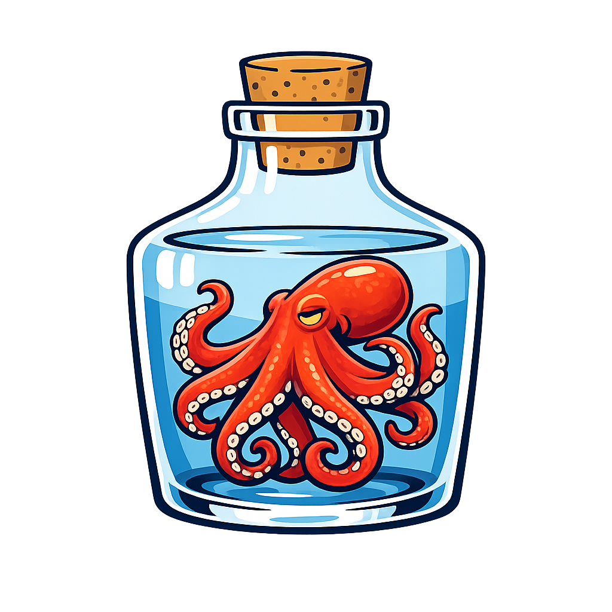
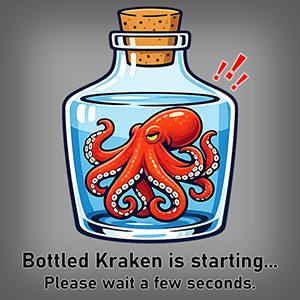

<p align="center">
   <br>
  
</p>

# Bottled Kraken

[Kraken](https://github.com/mittagessen/kraken) · [faster-whisper](https://github.com/SYSTRAN/faster-whisper) · [Zenodo OCR-Modelle](https://zenodo.org/communities/ocr_models/)

Bottled Kraken ist eine Desktop-OCR-Workbench auf Basis von Kraken. Das Projekt richtet sich an alle, die nicht nur schnell irgendeinen OCR-Text brauchen, sondern einen nachvollziehbaren Workflow: schwierige Scans vorbereiten, OCR ausführen, Zeilen prüfen, Segmentierung korrigieren, Text nachbearbeiten und das Ergebnis in brauchbaren Formaten exportieren.

Besonders sinnvoll ist Bottled Kraken für historische Drucke, Handschriften, Formulare und andere Seitenlayouts, bei denen ein rein automatischer OCR-Durchlauf meist nicht ausreicht.

<p align="center">
  
</p>

## Ansatz

Bottled Kraken verbindet mehrere Schritte, die sonst oft auf verschiedene Werkzeuge verteilt sind:

- **vorbereitende Bildbearbeitung** für schwierige Vorlagen,
- **layoutbezogene OCR mit Kraken**,
- **interaktive Bearbeitung von Zeilen und Overlay-Boxen**,
- **optionale lokale LM-Überarbeitung**,
- **optionale Mikrofonkorrektur mit Faster-Whisper**,
- sowie **strukturierte Exportformate** für die Weiterverarbeitung.

OCR wird hier also nicht als einmaliger Blackbox-Klick behandelt, sondern als bearbeitbarer Arbeitsprozess. Genau das ist die Grundidee des Projekts.

## Features

- OCR mit **Kraken** über getrennte Recognition- und Segmentierungsmodelle
- Unterstützung für **Bilder und PDFs**
- Queue-basierter Batch-Workflow für mehrere Dateien
- interaktive Anzeige erkannter Zeilen
- bearbeitbare **Overlay-Boxen** und Zeilenstruktur
- Zeilenfunktionen wie **verschieben, tauschen, ergänzen, löschen, teilen und neu ordnen**
- konfigurierbare **Leserichtung**
- integrierte **Bildbearbeitung** vor dem OCR-Lauf
- optionale **lokale LM-Überarbeitung** über OpenAI-kompatible Server
- optionale **Sprachkorrektur mit Faster-Whisper**
- Import von Zeilen aus **TXT** oder **JSON**
- Projekt speichern / laden über **JSON-Projektdateien**
- mehrsprachige Oberfläche (**Deutsch, Englisch, Französisch**)
- Hell- und Dunkelmodus
- Hardware-Auswahl für **CPU, CUDA, ROCm und MPS**

## Bildbearbeitung

Bottled Kraken bringt eine vorgeschaltete Bearbeitungsebene mit, wenn Dokumente mehr als nur einen simplen OCR-Durchlauf brauchen.

Verfügbare Werkzeuge sind unter anderem:

- Rotation
- Crop-Bereich
- Trennbalken für Doppelseiten oder geteilte Layouts
- Graustufen
- Kontrastanpassung
- weißen Rand hinzufügen
- Smart-Splitting

Das ist besonders hilfreich bei schlecht beschnittenen Scans, Doppelseiten, Archivmaterial, Formularseiten und kontrastarmen historischen Vorlagen.

## OCR-Workflow

Ein typischer Ablauf in Bottled Kraken sieht so aus:

1. Bild oder PDF laden
2. Seite optional mit der Bildbearbeitung vorbereiten
3. **Recognition-Modell** laden
4. **Segmentierungs-Modell** laden
5. Kraken-OCR starten
6. erkannte Zeilen und Boxen prüfen
7. Zeilen manuell, per lokalem LM oder per Spracheingabe korrigieren
8. Ergebnis exportieren

Bottled Kraken nutzt Kraken direkt aus Python heraus und ist stark auf die Idee ausgerichtet, dass OCR-Qualität wesentlich von sauberer Segmentierung abhängt. Deshalb ist die Arbeit mit **`blla`** der bevorzugte Weg, sobald ein passendes Segmentierungsmodell vorhanden ist.

## Lokale LM-Überarbeitung

Bottled Kraken kann OCR-Ergebnisse mit einem **lokalen Sprachmodell-Server** nachbearbeiten, solange dieser eine **OpenAI-kompatible Basis-URL** bereitstellt.

Typische lokale Setups sind:

| Server | Typische Basis-URL |
|---|---|
| LM Studio | `http://localhost:1234/v1` |
| Ollama | `http://localhost:11434/v1` |
| Jan | `http://127.0.0.1:1337/v1` |
| GPT4All | `http://localhost:4891/v1` |
| text-generation-webui | `http://127.0.0.1:5000/v1` |
| LocalAI | `http://localhost:8080/v1` |
| vLLM | `http://HOST:8000/v1` |

Diese Nachbearbeitung ist für lokale Arbeitsabläufe gedacht, in denen OCR-Zeilen sprachlich geglättet, vereinheitlicht oder kontrolliert werden sollen, ohne den gesamten Workflow in einen Cloud-Dienst zu verlagern.

## Remote-Zugriff per SSH-Tunnel

Wenn dein lokaler LM-Server auf einem anderen Rechner läuft, dort aber nur an `127.0.0.1` gebunden ist, lässt er sich trotzdem über einen SSH-Tunnel verwenden.

Beispiel:

```bash
ssh -L 1234:127.0.0.1:1234 user@192.168.1.50
```

Danach verwendest du in Bottled Kraken einfach:

```text
http://127.0.0.1:1234/v1
```

## Sprachkorrektur mit Faster-Whisper

Bottled Kraken kann **Faster-Whisper** für eine zeilenbezogene Mikrofonkorrektur verwenden.

Das ist nützlich, wenn:

- eine OCR-Zeile stark beschädigt ist,
- einzelne Felder oder Namen schneller eingesprochen als getippt werden,
- oder eine Korrektur bewusst auf genau eine Zeile begrenzt bleiben soll.

Es geht hier also nicht um die Volltranskription langer Audiodateien, sondern um gezielte Korrekturen innerhalb des OCR-Workflows.

## Exportformate

Bottled Kraken unterstützt den Export in mehrere Ausgabeformate:

| Kategorie | Formate |
|---|---|
| Fließtext | `txt` |
| strukturierte Daten | `csv`, `json` |
| OCR-Formate | `ALTO XML`, `hOCR` |
| Bilder | `png`, `jpg`, `bmp` |
| PDF | durchsuchbares PDF mit Bild + unsichtbarer Textebene |

Dadurch lässt sich derselbe OCR-Durchlauf sowohl für lesbare Endergebnisse als auch für strukturierte Weiterverarbeitung nutzen.

## Aus dem Quellcode starten

### Voraussetzungen

- Windows, Linux oder macOS
- empfohlen: **Python 3.10 oder 3.11**
- eine funktionsfähige Kraken- / PyTorch-Umgebung

### Repository klonen

```bash
git clone https://github.com/Testatost/Bottled-Kraken.git
cd Bottled-Kraken
```

### Virtuelle Umgebung erstellen

```bash
python -m venv .venv
```

Aktivieren:

```bash
# Linux / macOS
source .venv/bin/activate

# Windows PowerShell
.venv\Scripts\Activate.ps1
```

### Abhängigkeiten installieren

Da Bottled Kraken aktuell als quellbasierte Desktop-Anwendung vorliegt, sollten die vom aktuellen Code benötigten Python-Pakete in der eigenen Umgebung installiert werden.

Ein praktikabler Startpunkt ist:

```bash
pip install --upgrade pip
pip install pillow pyside6 reportlab torch kraken pymupdf numpy sounddevice huggingface_hub
```

Je nach Setup können zusätzlich weitere Pakete für Audio, GPU-Unterstützung oder Faster-Whisper nötig sein.

### Anwendung starten

```bash
python main.py
```

## Modellverwaltung

Bottled Kraken bringt OCR-Modelle nicht direkt mit. Stattdessen lädst du die Modelle, die zu deinem Material passen.

In der Praxis brauchst du meistens:

- ein **Recognition-Modell** für Schrift und Material,
- und optional ein **Segmentierungs-Modell** für `blla`.

Eine gute öffentliche Fundstelle für Kraken-kompatible Modelle ist die Zenodo-Sammlung:

- <https://zenodo.org/communities/ocr_models/>

Als Faustregel gilt: Ein Modell, das auf historische Drucke trainiert wurde, ist für historische Drucke meist deutlich besser als ein allgemeines Modell. Dasselbe gilt für Handschrift und formularlastiges Material.

## Warum Bottled Kraken?

Viele OCR-Werkzeuge enden nach der Erkennung. Bottled Kraken setzt genau in der Phase **zwischen OCR und fertigem Endtext** an:

- wenn Segmentierung noch korrigiert werden muss,
- wenn Zeilenstruktur wichtig ist,
- wenn Formulare oder Archivseiten Nacharbeit brauchen,
- und wenn möglichst lokal und transparent gearbeitet werden soll.

Wenn du eine GUI rund um Kraken suchst, die OCR nicht nur ausführt, sondern als editierbaren Workflow behandelt, dann ist Bottled Kraken genau für diesen Anwendungsfall gebaut.

## Lizenz

Dieses Repository steht unter **MIT**. Bitte beachte zusätzlich die Lizenzen der externen Modelle und Bibliotheken, die du zusammen mit der Anwendung verwendest.
