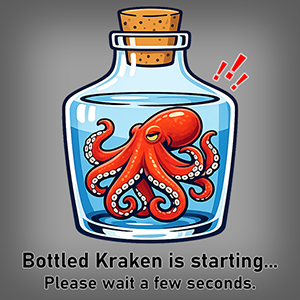

<p align="center">
   <br>
  
</p>

# Bottled Kraken – Windows 10/11

[Kraken](https://github.com/mittagessen/kraken) · [faster-whisper](https://github.com/SYSTRAN/faster-whisper) · [Zenodo OCR-Modelle](https://zenodo.org/communities/ocr_models/)

Bottled Kraken ist eine Desktop-OCR-Workbench auf Basis von **Kraken**.  
Das Projekt richtet sich an alle, die nicht einfach nur schnell irgendeinen OCR-Text brauchen, sondern einen **nachvollziehbaren und bearbeitbaren Workflow**:

- schwierige Scans vorbereiten
- OCR ausführen
- Zeilen prüfen
- Segmentierung korrigieren
- Text nachbearbeiten
- und Ergebnisse in brauchbaren Formaten exportieren

Besonders sinnvoll ist Bottled Kraken für **historische Drucke, Handschriften, Formulare** und andere Seitenlayouts, bei denen ein rein automatischer OCR-Durchlauf oft nicht ausreicht.

<p align="center">
  
</p>

---

## Ansatz

Bottled Kraken verbindet mehrere Arbeitsschritte, die sonst oft auf verschiedene Werkzeuge verteilt sind:

- **vorbereitende Bildbearbeitung** für schwierige Vorlagen
- **layoutbezogene OCR mit Kraken**
- **interaktive Bearbeitung von Zeilen und Overlay-Boxen**
- **optionale lokale LM-Überarbeitung**
- **optionale Mikrofonkorrektur mit Faster-Whisper**
- **strukturierte Exportformate** für die Weiterverarbeitung

OCR wird hier also nicht als einmaliger Blackbox-Klick behandelt, sondern als **editierbarer Arbeitsprozess**. Genau das ist die Grundidee des Projekts.

---

## Features

- OCR mit **Kraken** über getrennte Recognition- und Segmentierungsmodelle
- Unterstützung für **Bilder und PDFs**
- queue-basierter Batch-Workflow für mehrere Dateien
- interaktive Anzeige erkannter Zeilen
- bearbeitbare **Overlay-Boxen** und Zeilenstruktur
- Zeilenfunktionen wie **verschieben, tauschen, ergänzen, löschen, teilen und neu ordnen**
- konfigurierbare **Leserichtung**
- integrierte **Bildbearbeitung** vor dem OCR-Lauf
- optionale **lokale LM-Überarbeitung** über OpenAI-kompatible Server
- optionale **Sprachkorrektur mit Faster-Whisper**
- lokaler **eScriptorium-Server** mit automatischer nativer Installation für Fedora, Linux Mint und Windows/WSL2
- Import von Zeilen aus **TXT** oder **JSON**
- Projekt speichern / laden über **JSON-Projektdateien**
- mehrsprachige Oberfläche in **16 Sprachen**
- Hell- und Dunkelmodus
- Hardware-Auswahl für **CPU, CUDA, ROCm und MPS**

---

## Bildbearbeitung

Bottled Kraken bringt eine vorgeschaltete Bearbeitungsebene mit, wenn Dokumente mehr als nur einen simplen OCR-Durchlauf brauchen.

Verfügbare Werkzeuge sind unter anderem:

- Rotation
- Crop-Bereich
- Trennbalken für Doppelseiten oder geteilte Layouts
- Graustufen
- Kontrastanpassung
- weißen Rand hinzufügen
- Smart-Splitting

Das ist besonders hilfreich bei schlecht beschnittenen Scans, Doppelseiten, Archivmaterial, Formularseiten und kontrastarmen historischen Vorlagen.

---

## OCR-Workflow

Ein typischer Ablauf in Bottled Kraken sieht so aus:

1. Bild oder PDF laden
2. Seite optional mit der Bildbearbeitung vorbereiten
3. **Recognition-Modell** laden
4. **Segmentierungs-Modell** laden
5. Kraken-OCR starten
6. erkannte Zeilen und Boxen prüfen
7. Zeilen manuell, per lokalem LM oder per Spracheingabe korrigieren
8. Ergebnis exportieren

Bottled Kraken nutzt Kraken direkt aus Python heraus und ist stark auf die Idee ausgerichtet, dass die OCR-Qualität wesentlich von sauberer Segmentierung abhängt. Deshalb ist die Arbeit mit **`blla`** der bevorzugte Weg, sobald ein passendes Segmentierungsmodell vorhanden ist.

---

## Lokale LM-Überarbeitung

Bottled Kraken kann OCR-Ergebnisse mit einem **lokalen Sprachmodell-Server** nachbearbeiten, solange dieser eine **OpenAI-kompatible Basis-URL** bereitstellt.

Typische lokale Setups sind:

| Server | Typische Basis-URL |
|---|---|
| LM Studio | `http://localhost:1234/v1` |
| Ollama | `http://localhost:11434/v1` |
| Jan | `http://127.0.0.1:1337/v1` |
| GPT4All | `http://localhost:4891/v1` |
| text-generation-webui | `http://127.0.0.1:5000/v1` |
| LocalAI | `http://localhost:8080/v1` |
| vLLM | `http://HOST:8000/v1` |

Diese Nachbearbeitung ist für lokale Arbeitsabläufe gedacht, in denen OCR-Zeilen sprachlich geglättet, vereinheitlicht oder kontrolliert werden sollen, ohne den gesamten Workflow in einen Cloud-Dienst zu verlagern.

---

## Remote-Zugriff per SSH-Tunnel

Wenn dein lokaler LM-Server auf einem anderen Rechner läuft, dort aber nur an `127.0.0.1` gebunden ist, lässt er sich trotzdem über einen SSH-Tunnel verwenden.

Beispiel:

```bash
ssh -L 1234:127.0.0.1:1234 user@192.168.1.50
```

Danach verwendest du in Bottled Kraken einfach:

```text
http://127.0.0.1:1234/v1
```

---

## Sprachkorrektur mit Faster-Whisper

Bottled Kraken kann **Faster-Whisper** für eine zeilenbezogene Mikrofonkorrektur verwenden.

Das ist nützlich, wenn:

- eine OCR-Zeile stark beschädigt ist
- einzelne Felder oder Namen schneller eingesprochen als getippt werden
- oder eine Korrektur bewusst auf genau eine Zeile begrenzt bleiben soll

Es geht hier also nicht um die Volltranskription langer Audiodateien, sondern um **gezielte Korrekturen innerhalb des OCR-Workflows**.

---

## Lokales eScriptorium

Rechts neben **Whisper-Optionen** befindet sich der Hauptmenüpunkt
**eScriptorium**. Im Dialog wird einmalig das verwendete Betriebssystem
gewählt:

- Fedora Linux
- Linux Mint
- Windows 10/11 mit WSL2

Die Installation und der Serverstart sind bewusst getrennt. Unter Windows
richtet Bottled Kraken dafür eine eigene WSL2-Ubuntu-24.04-Distribution ein.
Zuerst wird **eScriptorium installieren / aktualisieren** ausgeführt. Bottled
Kraken lädt und konfiguriert dabei im Hintergrund PostgreSQL, Redis, Python,
Kraken, Celery, Django und das Web-Frontend. **Server starten** startet
anschließend ausschließlich die bereits installierten Dienste. Sobald
`http://127.0.0.1:8000/` antwortet, wird eScriptorium im nativen Windows-
Standardbrowser geöffnet. Docker und Docker Compose werden nicht verwendet.

Während der Installation zeigt eine animierte Kreis-Ladeanzeige, dass der
Vorgang weiterläuft. Die Ausgabe von `dnf`, `apt`, `pip`, `npm`, Django und den
übrigen Einrichtungsprogrammen wird fortlaufend im Dialog angezeigt, statt bis
zum Prozessende unsichtbar gepuffert zu werden. Über **Abbrechen** kann der
aktuelle Unterprozess kontrolliert beendet werden. Ein abgebrochener oder
fehlgeschlagener Erstlauf hinterlässt keinen Fertig-Marker; der nächste Klick
auf **eScriptorium installieren / aktualisieren** setzt die Einrichtung
reparierend erneut an.

Die offizielle Datei `app/requirements.txt` bleibt die Quelle der
eScriptorium-Python-Abhängigkeiten. Bottled Kraken erzeugt daraus in der WSL2-
Laufzeit eine nachvollziehbare Kompatibilitätskopie: Der veraltete pyvips-2.1-
Pin und direkte Torch-Pins werden dort entfernt und separat plattformgerecht
installiert. In WSL2 erhält eScriptorium pyvips 3.1.1 für die Ubuntu-libvips-
Bibliothek; falls der optionale CFFI-API-Build scheitert, wird automatisch auf
den ABI-Modus mit der System-libvips-Bibliothek zurückgefallen. Torch 2.12.0 und
torchvision 0.27.0 werden als getestetes CPU-Paar installiert und anschließend
exakt für den übrigen Resolver fixiert. Die bewusst nicht verwendete Version
2.12.1 überschreitet Krakens Metadatenobergrenze `torch<=2.12`. Eine
`requirements-native.txt` wird weder erwartet noch erzeugt.

Fehlt WSL2, zuerst in einer administrativen PowerShell `wsl --install` ausführen, Windows neu starten und sicherstellen, dass Virtualisierung im BIOS/UEFI aktiviert ist. Unter Windows importiert Bottled Kraken eine eigene Ubuntu-24.04-Umgebung in
WSL2 und steuert die eScriptorium-Dienste automatisch über `wsl.exe` und
systemd. Die Aktivierung von WSL2 kann einen einmaligen Windows-Neustart
erfordern. Danach wird die Installation über **eScriptorium installieren /
aktualisieren** fortgesetzt. Der Browser läuft weiterhin nativ unter Windows und
erreicht den WSL2-Server über localhost. PostgreSQL verwendet in WSL2 ein kurzes
systemd-`RuntimeDirectory` unter `/run`, damit keine Windows-Pfade und keine zu
langen Unix-Socket-Pfade in den Datenpfad geraten.

Der Reiter **Hinweise → eScriptorium** enthält dieselbe Betriebssystemauswahl,
den Installations-/Aktualisierungsbutton, die Dokumentation sowie Schaltflächen
zum Öffnen des ausgewählten eScriptorium-Ordners und der Zugangsdaten. Der
Ordner-Button verwendet unter Windows den Explorer und unter Linux den
installierten Desktop-Dateimanager.

Die Standardpfade sind:

```text
Windows: %LOCALAPPDATA%\BottledKraken\escriptorium\platforms\windows_wsl\
WSL:     \\wsl.localhost\BottledKraken-eScriptorium\opt\bottled-kraken-escriptorium
```

Der Basisordner kann mit `BOTTLED_KRAKEN_USER_DIR` überschrieben werden. Der
Quellstand kann mit `BOTTLED_KRAKEN_ESCRIPTORIUM_REF` festgelegt werden;
Standard ist `26.04.1`. Ein normales Stoppen beendet nur die Dienste und
löscht keine Projekte, Datenbanken, Modelle oder Medien.

---

## Exportformate

Bottled Kraken unterstützt den Export in mehrere Ausgabeformate:

| Kategorie | Formate |
|---|---|
| Fließtext | `txt` |
| strukturierte Daten | `csv`, `json` |
| OCR-Formate | `ALTO XML`, `hOCR` |
| Bilder | `png`, `jpg`, `bmp` |
| PDF | durchsuchbares PDF mit Bild + unsichtbarer Textebene |

Dadurch lässt sich derselbe OCR-Durchlauf sowohl für lesbare Endergebnisse als auch für strukturierte Weiterverarbeitung nutzen.

---

## Aus dem Quellcode starten

### Voraussetzungen

- Windows 10 oder Windows 11, 64 Bit
- Python 3.13 x64 empfohlen; Python 3.12 x64 wird vom Buildskript ebenfalls akzeptiert
- PowerShell 5.1 oder PowerShell 7
- eine funktionsfähige Kraken- / PyTorch-CPU-Umgebung

### Repository klonen

```powershell
git clone https://github.com/Testatost/Bottled-Kraken.git
cd Bottled-Kraken
```

### Build-Umgebung prüfen

```powershell
Set-ExecutionPolicy -Scope Process Bypass
.\check_windows_10_11_build_environment.ps1
```

### Virtuelle Umgebung erstellen

```powershell
py -3.13 -m venv .venv
.\.venv\Scripts\Activate.ps1
```

### Abhängigkeiten installieren

Für eine bestehende PyCharm-venv:

```powershell
python -m pip install --upgrade pip setuptools wheel
python -m pip install -r requirements-lock-windows.txt
python -m pip install --no-deps kraken==7.0.3
```

`requirements.txt` beschreibt die Windows-Abhängigkeiten lesbar. Der reproduzierbare
Release-Build verwendet `requirements-lock-windows.txt`. Kraken wird anschließend
mit `--no-deps` installiert, weil die für Bottled Kraken nicht benötigte
CoreML-Abhängigkeit auf Windows nicht zum Zielumfang gehört.

### Anwendung starten

```powershell
python main.py
```

### PyInstaller-Build für Windows 10/11

```powershell
Set-ExecutionPolicy -Scope Process Bypass
.\build_windows_10_11.ps1
```

Das fertige Onefile-Programm liegt danach unter `dist\Bottled Kraken.exe`.

## Modellverwaltung

Bottled Kraken bringt OCR-Modelle nicht direkt mit. Stattdessen lädst du die Modelle, die zu deinem Material passen.

In der Praxis brauchst du meistens:

- ein **Recognition-Modell** für Schrift und Material
- und optional ein **Segmentierungs-Modell** für `blla`

Eine gute öffentliche Fundstelle für Kraken-kompatible Modelle ist die Zenodo-Sammlung:

- <https://zenodo.org/communities/ocr_models/>

Als Faustregel gilt: Ein Modell, das auf historische Drucke trainiert wurde, ist für historische Drucke meist deutlich besser als ein allgemeines Modell. Dasselbe gilt für Handschrift und formularlastiges Material.

---

## Warum Bottled Kraken?

Viele OCR-Werkzeuge enden nach der Erkennung. Bottled Kraken setzt genau in der Phase **zwischen OCR und fertigem Endtext** an:

- wenn Segmentierung noch korrigiert werden muss
- wenn Zeilenstruktur wichtig ist
- wenn Formulare oder Archivseiten Nacharbeit brauchen
- und wenn möglichst lokal und transparent gearbeitet werden soll

Wenn du eine GUI rund um Kraken suchst, die OCR nicht nur ausführt, sondern als editierbaren Workflow behandelt, dann ist Bottled Kraken genau für diesen Anwendungsfall gebaut.

---

## Whisper-Zeilendiktat und UTF-8

Das Diktieren einzelner OCR-Zeilen wird in einem getrennten Bottled-Kraken-
Prozess ausgeführt. Dieser Prozess startet ausdrücklich im UTF-8-Modus und
überträgt das Ergebnis als ASCII-sicheres JSON. Dadurch hängen Umlaute,
Nicht-ASCII-Gerätenamen und Modellpfade nicht von der Terminal- oder
System-Locale ab. Temporäre WAV- und Protokolldateien liegen in einem privaten,
kurzen Laufzeitordner und werden nach dem Vorgang wieder entfernt.

## Kraken-Aktualisierung

Unter **Hinweise → Kraken** kann die aktive Kraken-Version über
**Kraken aktualisieren** auf den neuesten Stand des offiziellen
`mittagessen/kraken`-Repositories gebracht werden. Der Updater ermittelt das neueste stabile GitHub-Release, löst dessen Tag auf
einen konkreten Commit auf und lädt das zu genau diesem Commit gehörende
GitHub-Quellarchiv in einen privaten Benutzerordner und prüft dort die für
Bottled Kraken benötigten Kraken-Module. Erst nach erfolgreicher Prüfung wird
der neue Stand atomar aktiviert; wirksam wird er nach einem Neustart der
Anwendung.

Die mit der Anwendung gebündelte Kraken-Fassung bleibt als Rückfallversion
erhalten. Die aktualisierte Fassung wird zur Laufzeit gezielt vor der
gebündelten Fassung geladen, auch in einem PyInstaller-Build. Mit
`BOTTLED_KRAKEN_DISABLE_KRAKEN_OVERLAY=1` lässt sich die externe Fassung für
einen Start deaktivieren. Für den Vorgang ist keine separate Git-, Python- oder
`pip`-Installation nötig; der Updater verwendet die vorhandene Bottled-Kraken-
Laufzeit und lädt ausschließlich das festgelegte GitHub-Commitarchiv.

---

## Lizenz

Der originale Bottled-Kraken-Code steht unter **MIT**. Abhängigkeiten und
optionale Downloads behalten ihre eigenen Lizenzen. Besonders wichtig:
PyMuPDF/MuPDF ist dual unter **AGPL-3.0** oder einer kommerziellen
Artifex-Lizenz verfügbar. Vor der Weitergabe eines gebündelten Binaries muss
die passende Lizenzroute geklärt und vollständig eingehalten werden.
